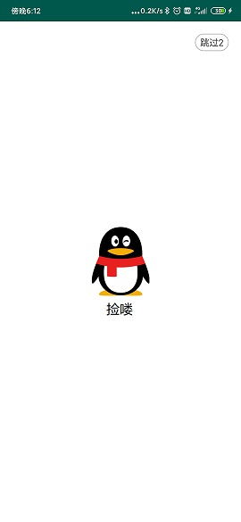
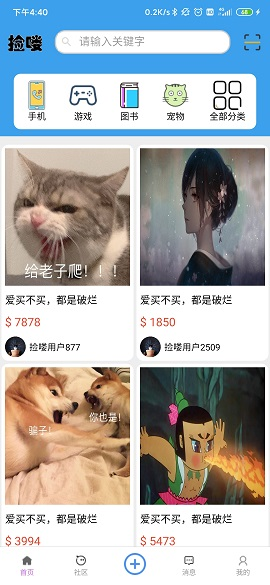
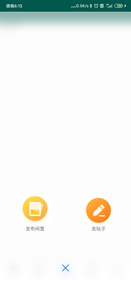
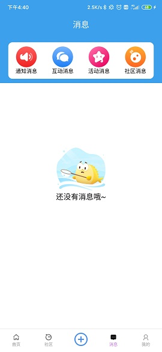
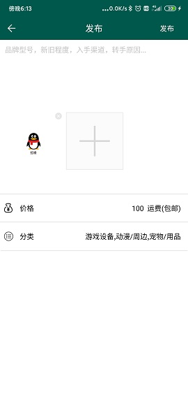
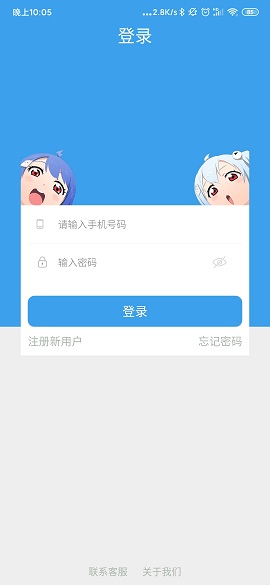
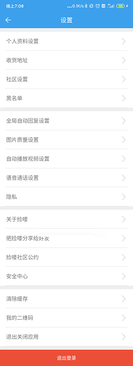
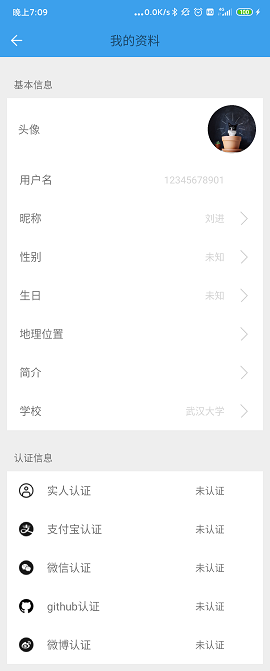
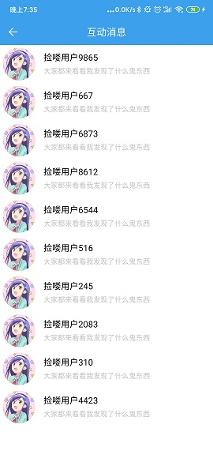

# 捡喽


## 面向校园的二手交易平台APP

***

### **简介**

> **项目简介**

软件工程大作业，一款面向大学生群体的二手交易平台App，就是模仿咸鱼。

> **开发环境**

```开发环境
前端:
    IDE:Android Studio
    Language: Java

后台:
    IDE:Pycharm
    Language: python
    框架：Django
```

> **工程结构**

```目录树
 |
 |-----main
        |-----AndroidManifest.xml      -注册文件
 |      |-----res                      -存放layout和图片等媒体文件的位置
 |      |-----java                     -Java代码所处的地方
 |-----APP                             -示例APP
 |-----project                         -完整的工程文件
 |-----houtai                          -后台的Django代码
```

> **项目依赖**

```项目依赖
    //相册所需模块
    implementation 'com.github.LuckSiege.PictureSelector:picture_library:v2.2.9'
    implementation "androidx.recyclerview:recyclerview:1.1.0"
    implementation 'com.github.bumptech.glide:glide:4.10.0'
    annotationProcessor 'com.github.bumptech.glide:compiler:4.10.0'
    implementation "io.reactivex.rxjava2:rxjava:2.2.14"
    implementation 'io.reactivex.rxjava2:rxandroid:2.1.1'
    testImplementation 'com.squareup.leakcanary:leakcanary-android-no-op:1.6.2'
    debugImplementation 'com.squareup.leakcanary:leakcanary-android:1.6.2'
    releaseImplementation 'com.squareup.leakcanary:leakcanary-android-no-op:1.6.2'
    //网络所需模块
    implementation "com.squareup.okhttp3:okhttp:3.10.0"
    //头像模块
    implementation 'com.squareup.picasso:picasso:2.71828'
    //设置模块
    implementation 'com.leon:lsettingviewlibrary:1.7.0'
    //搜索
    implementation 'com.carson_ho:SearchLayout:1.0.1'
    //GSON
    implementation 'com.google.code.gson:gson:2.8.5'
    //下拉刷新
    implementation 'com.github.recruit-lifestyle:WaveSwipeRefreshLayout:1.6'
    //分类
    implementation 'com.facebook.fresco:fresco:0.11.0'
    implementation 'com.alibaba:fastjson:1.1.46.android'
    //数据库
    implementation 'org.litepal.android:core:1.4.1'
```

> **项目进展**

| 时间        | 完成情况                                       |
| :----------|:------------------------------------------------|
| 2019-10-24 | 完成小组成员的组建，基本确定各个成员的分工           |
| 2019-10-31 | 完成项目工程的创建，同时完成底部导航栏               |
| 2019-11-07 | 完成发布项目的模仿微博菜单弹出的动画。               |
| 2019-11-15 | 完成发布的模仿咸鱼的界面。实现九宫格和访问相册，相机   |
| 2019-11-16 | 完成APP与服务器端的数据交互                        |
| 2019-11-20 | 优化代码结构，进行详细的注释，去除不必要的文件        |
| 2019-11-21 | 完成登录注册界面的布局和代码逻辑，新增开机logo       |
| 2019-11-26 | 完成自动登录功能，加入主页搜索界面,更换主题颜色为蓝色 |
| 2019-11-26 | 完成个人界面的设置，暂时可以修改昵称                |
| 2019-11-29 | 完成各个界面的基本布局，可以见人了，但是还没有什么功能 |
| 2019-12-04 | 完成交互消息界面的消息列表功能，实现类似微信的长按删除 |
| 2019-12-04 | 完成聊天界面的layout设计                          |
| 2019-12-05 | 完成聊天界面的基本功能                             |
| 2019-12-14 | 所有界面基本实现了，与网络的交互图片也已经完成，收尾中 |
| 2019-12-15 | 主要各个功能全部打通,开始正式收尾                   |
| 2019-12-15 | 聊天界面,主页界面可以告一段落结束了                 |
| 2019-12-18 | 加入上拉加载和下拉刷新，完成所有功能，完工          |

> **项目统计**

前端Java代码:5887行

前端XML代码：3966行

后端python代码：1912行

> **项目成员**

[刘进](https://github.com/jinexplorer)（APP开发）
[李易](https://github.com/liyiblog)（后台开发）

> **项目demo**

[捡喽.apk](./APP/捡喽.apk)

> **预览图片**















> **免责声明**

本项目所采用的技术均来自网上，本项目所采用的图片均来自网上。感谢各位网友朋友的开源分享，本项目仅用于学习交流，严禁商用，一切责任概不负责

> **参考链接**

整体框架：[咸鱼APP](https://2.taobao.com/)

导航栏：[Android底部菜单栏实现的实例代码_Android_脚本之家](https://www.jb51.net/article/140081.htm)

App桌面图标:[BingoIcon-在线制作图标_文字图标在线生成](https://bingoicon.com/font)

导航栏，主页，社区，我的发布界面图标：[Iconfont-阿里巴巴矢量图标库](https://www.iconfont.cn/collections/detail?spm=a313x.7781069.1998910419.d9df05512&cid=33)

发布按钮的弹出动画：[gqdy365/WeiboPopupWindow: 模仿新浪微博菜单弹出界面；](https://github.com/gqdy365/WeiboPopupWindow)

消息界面图标：[咸鱼APP](https://2.taobao.com/)

发布界面点击提示：[【Android】在非繼承自Activity的類別內顯示toast](https://medium.com/@leowang0308/android-%E5%9C%A8%E9%9D%9E%E7%B9%BC%E6%89%BF%E8%87%AAactivity%E7%9A%84%E9%A1%9E%E5%88%A5%E5%85%A7%E9%A1%AF%E7%A4%BAtoast-457b3a677ced)

发布界面九宫格以及访问相册：[LuckSiege/PictureSelector: Picture Selector Library for Android  or 多图片选择器](https://github.com/LuckSiege/PictureSelector)

发布界面分类选择界面多选器：[ahuyangdong/SelectCustom: Android实现自由单选、复选按钮效果+样式美化](https://github.com/ahuyangdong/SelectCustom)

启动/登录logo： [腾讯QQ](https://im.qq.com/pcqq/)

启动计时： [qianhezheng/LaunchAd: Android广告启动页](https://github.com/qianhezheng/LaunchAd)

启动布局： [ladingwu/Splash: Android 启动页动画demo](https://github.com/ladingwu/Splash)

登陆注册： [wenzhihao123/Android-loginsmooth-master: android 登录页面平滑动画，监听键盘弹起与收起](https://github.com/wenzhihao123/Android-loginsmooth-master)

首页搜索样式：[yetwish/CustomSearchView: customer search view](https://github.com/yetwish/CustomSearchView)

圆形头像： [square/picasso: A powerful image downloading and caching library for Android](https://github.com/square/picasso)

头像图片： [SheHuan/NiceImageView: Android 圆角、圆形 ImageView](https://github.com/SheHuan/NiceImageView)

圆形头像及设置界面： [leonHua/LSettingView: 非常常用的设置界面条目 very useful setting item](https://github.com/leonHua/LSettingView)

交互消息弹出菜单框及删除： [18_创建 RecyclerView 上下文菜单 ContextMenu - 简书](https://www.jianshu.com/p/38f935009c14)

下拉刷新： [recruit-lifestyle/WaveSwipeRefreshLayout](https://github.com/recruit-lifestyle/WaveSwipeRefreshLayout)

首页搜索： [Carson-Ho/Search_Layout: 一款封装了 历史搜索记录功能 &amp; 样式 的Android自定义搜索框](https://github.com/Carson-Ho/Search_Layout)

分类界面： [kevinTutu/CategoryDemo: 仿京东、拼多多分类页](https://github.com/kevinTutu/CategoryDemo)

上拉加载： [Android RecyclerView下拉刷新 &amp; 上拉加载更多 - 简书](https://www.jianshu.com/p/b502c5b59998)

> **参考图书**

Android 第一行代码（第二版）

> **总结**

项目已经告一段落了。课程展示也还算是比较理想，可能也是因为在最后了，老师也就没有问很多的问题，不过第一个问题就是问我们的启动广告有了吗。咳咳咳，怎么可能，又没人给我们钱做广告。

在这个APP自己耗费了大量的精力，不过也学到了很多，相比于之前的自己能开发一个APP还是相对来说有点成就感的。为自己下一步的学习开发打一个基础。感到可惜的就是自己找了半天了图标，调整了很长时间的laout设计没人注意到。总之APP上自己还有很多需要学习的地方。很多的地方在一开始就走错了路。比如mipmap和drawable。当时学的时候误会了，后面自己也不想再移动了，这么多图片和drawable文件放在一起，担心自己找不到。

自己需要学习的地方还有很多，比如drawable文件很多利用之前的改一下，自己并没有系统的学习过如何写。很多实现的功能都是靠着网上的代码，自己并没有细看细节，就像那个把头像变圆形的地方。还有处理子线程很主线程的问题，还有网络通信的保障问题，还有聊天模块的糟糕实现。总之，自己还有很多需要学习进步的地方。任重而道远。
